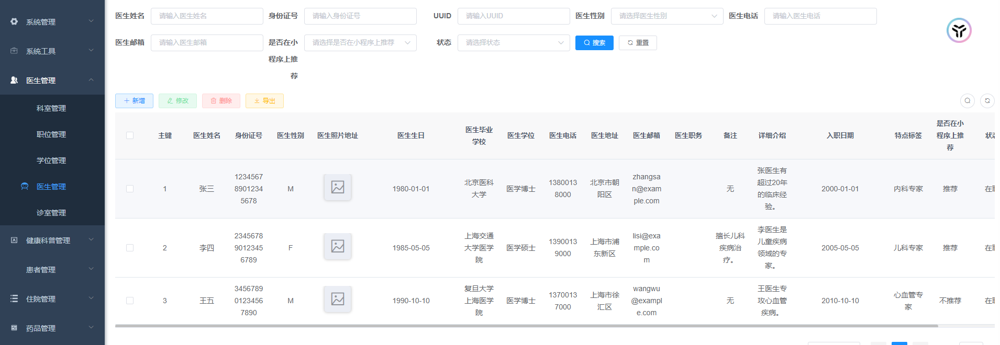

# 项目描述
        EHO互联网医疗系统是为大连市XXX 医院开发并实施的线上医疗系统，移动端小程序为患者提供了挂号缴费、问诊等服务，并且为管理者提供了 MIS 管理平台，可以管理医疗系统各个模块的业务数据。由于采用了先 进的人脸识别和静态活体检测技术，可以识别挂号者是不是患者本人，杜绝黄牛倒卖专家号。本项目还采用了 TRTC 音视频服务，可以实现患者端和医生端的实时视频问诊功能，做到视频信号稳定清晰。

# 开发环境
        JDK15.02 +IDEA + HBase + Redis + RabbitMQ + Minio + HBuilderX

# 项目技术栈
## 移动端：
        UniApp、Vue2.0、uView、人脸识别服务、OCR 插件、TRTC 服务

## 后端项目：
        SpringBoot、SpringMVC、MyBatis、SaToken、Quartz、WebSocket

## 前端项目：
        Vue3.0ElementPlus、TRTC 服务

# 主要工作
+   设计了后端项目全局异常处理、异步线程任务、 WebSocket 消息推送 。
+   参与封装了前端MIS系统的同步/异步Ajax 请求与异常处理。
+    利用 TRTC 技术实现移动端和 Web 端的视频问诊。
+    参与开发了门诊挂号、移动支付、线上问诊、出诊管理等模块的开发。

