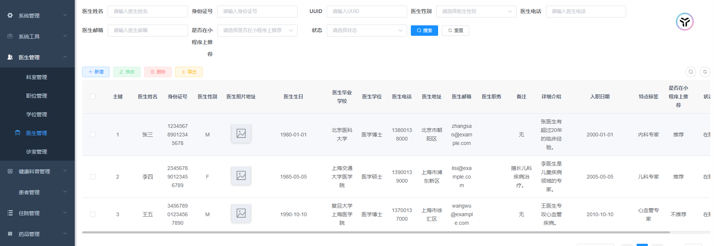

# Star项目以便获取最新动态
qq交流群： **1081725203**
# 项目描述
        智慧医疗挂号系统，为患者、医生和管理者提供一站式医疗服务平台。
        移动端小程序为患者提供了挂号、视频问诊、消息通知、就诊评价、医生收藏等服务；同时为管理者和医生提供了 MIS 管理平台，用于维护医生、科室、排班、评价、收藏等业务数据。本项目集成了 TRTC 音视频能力，可支持患者端与医生端实时视频问诊。
        添加AI助手，便于患者预约挂号。
# 最近更新
- 小程序医生详情页补充了电话、收藏状态、评分汇总等信息
- 小程序个人中心新增“我的收藏”入口，并支持查看收藏医生列表
- 后台新增“收藏管理”页面，可查看医生/患者收藏记录
- 后台医生管理页补充医生被收藏次数展示
- 当前版本已移除挂号前的人脸识别前置校验，挂号不再依赖人脸录入与人脸验证
- 新增患者侧 AI 挂号助手页，首页与个人中心都可进入助手流程
- Agent 一期已打通“查询 → 条件校验 → 确认 → 挂号”链路，并保留 Redis 会话记忆与风险确认
- 当前多 Agent 默认走 `POST /agent/multi/chat`，前端页面仍复用 `patient-wx/agent/chat/chat.vue`
- 当前多 Agent 仅支持挂号相关操作，不作为通用闲聊助手使用；页面会展示“当前步骤 / Agent 执行流程 / 可执行卡片”
- 多 Agent 挂号链路已补充事务、幂等锁、二次复核、审计表和 Quartz 巡检补偿，数据库升级脚本见 `sql/patient_wx_multi_agent_registration_upgrade.sql`
- 多 Agent 挂号链路已进一步补齐服务端确认闭环、payload 规范化校验、`requestId` 回放幂等、坏例留痕，以及只读工具“重试一次 + 降级”保护
- 新增管理端“电子处方”独立页，医生可按挂号单开立/编辑处方，患者侧支持按挂号单查看处方详情
- 补充 AI 挂号助手面试说明与项目讲解材料，见 docs
- 多 Agent 已接入真实 LLM NLU 管道：Python 服务调通义千问做意图识别与槽位提取，Java 通过 HTTP 调用并支持一键降级规则引擎

# 项目结构
```
hospital
├── hospital-api-mysql       # 管理系统后端（MySQL版）
├── hospital-api             # 管理系统后端（HBase版）
├── hospital-vue             # 管理系统前端（Vue3 + ElementPlus）
├── patient-wx-api-mysql     # 小程序后端（MySQL版）
├── patient-wx-api           # 小程序后端（HBase版）
├── patient-wx               # 患者端小程序（UniApp）
├── sql                      # 数据库建表SQL
├── docs                     # 部署文档
├── model-inference-demo     # 模型微调与推理加速演示（面试用）
├── Minio                    # 静态资源（图片等）
└── video                    # 视频相关资源
```

# 开发者快速导航
> 日常开发建议优先关注 MySQL 版本链路：`hospital-api-mysql`、`patient-wx-api-mysql`、`hospital-vue`、`patient-wx`。HBase 目录更适合作为历史实现对照。

| 子项目 | 面向角色 | 主要职责 | 技术栈 | 建议先看 |
| --- | --- | --- | --- | --- |
| `hospital-api-mysql` | 管理员、医生、MIS | 管理科室、诊室、医生、排班、评价、收藏、视频问诊等后台能力 | Spring Boot 2.7、MyBatis、Sa-Token、Redis、Quartz、WebSocket | `src/main/java/com/example/hospital/api/HospitalApiApplication.java`、`src/main/resources/application.yml` |
| `patient-wx-api-mysql` | 患者小程序 | 登录注册、就诊卡、挂号、消息、评价、视频问诊等患者侧接口 | Spring Boot 2.7、MyBatis、Sa-Token、Redis、Quartz | `src/main/java/com/example/hospital/patient/wx/api/PatientWxApiApplication.java`、`src/main/resources/application.yml` |
| `hospital-vue` | 管理员、医生 | MIS 管理端页面、权限菜单、后台数据维护与统计 | Vue3、Vite、Element Plus、vue-router、jQuery Ajax、WebSocket | `src/main.js`、`src/router/index.js`、`src/views/` |
| `patient-wx` | 患者 | 小程序挂号、消息、评价、收藏、视频问诊、就诊卡 | uni-app、Vue2、uView、微信插件、TRTC | `main.js`、`pages.json`、`manifest.json` |

面向 Claude/协作者的项目级说明见根目录 `CLAUDE.md`。

## Claude Code / Karpathy Skills
- 当前仓库已接入本地 Karpathy 风格 Claude Code 能力。
- 项目级协作说明位于：`CLAUDE.md`
- 本地 Skill 文件位于：`.claude/skills/karpathy-guidelines/SKILL.md`
- 本地命令文件位于：`.claude/commands/karpathy.md`
- 在 Claude Code 中可直接使用：`/karpathy`
- 示例：`/karpathy patient-wx 挂号流程`、`/karpathy hospital-vue 页面重构`
- 该能力会强化四个协作原则：先想再写、简单优先、手术式修改、目标驱动。
- 当前仓库还补充了 5 个仅面向项目实现细节的私有 Skills：
  - `/multi-agent-map`：快速梳理当前多 Agent 挂号架构、阶段流转与局部 ReAct 落点
  - `/rag-boundary-check`：核对当前 RAG 的知识源、检索方式、职责边界与非职责范围
  - `/registration-trace`：顺着真实挂号链路定位校验、提交、幂等锁、审计与补偿代码
  - `/agent-guardrail-check`：检查 AI 挂号流程中的阶段守卫、确认机制、请求治理与兜底设计
  - `/doc-code-drift`：对比 README / docs / 代码实现，检查 AI 挂号文档是否与当前实现漂移

# 功能模块
## 患者端小程序
- 门诊挂号：按科室/医生选择号源，在线预约挂号
- 视频问诊：基于TRTC的实时视频问诊，支持提交问诊资料
- 消息通知：挂号成功通知、就诊提醒（每日定时推送）、系统消息
- 就诊评价：对医生进行星级评分和文字评价
- 医生收藏：支持收藏/取消收藏医生，在个人中心查看“我的收藏”
- 电子处方：查看医生开具的电子处方
- 个人中心：就医信息卡管理、挂号记录、问诊订单、我的评价、我的收藏
- 医生详情：支持查看医生简介、电话、评分汇总、评价列表、收藏状态

## 管理系统（MIS）
- 科室管理：科室及子科室的增删改查
- 医生管理：医生信息、出诊计划管理、收藏次数查看
- 挂号管理：挂号记录查询与管理
- 评价管理：支持按医生/患者/评分/来源查询评价记录
- 收藏管理：支持按医生/患者/手机号/时间查询收藏记录
- 电子处方管理：支持医生按挂号单开立、编辑电子处方
- 视频问诊管理：问诊订单管理
- 系统管理：用户、角色、权限管理

# 开发环境
* 版本一：JDK15.02 + IDEA + HBase + Redis + RabbitMQ + Minio + HBuilderX
* 版本二：JDK8 + IDEA + MySQL + Redis + Minio + HBuilderX（MySQL版本，避免了部署的麻烦，更适合小白的一套智慧医疗挂号小程序）

# 项目技术栈
## 移动端：
        UniApp、Vue2.0、uView、OCR服务、TRTC 服务

## 后端项目：
        SpringBoot、SpringMVC、MyBatis、SaToken、Quartz、WebSocket

## 前端项目：
        Vue3.0、ElementPlus、TRTC 服务

# 代码入口与联调关系
## 后端
- `hospital-api-mysql`
  - 启动入口：`hospital-api-mysql/src/main/java/com/example/hospital/api/HospitalApiApplication.java`
  - 关键配置：`hospital-api-mysql/src/main/resources/application.yml`
  - 默认端口：`8094`
  - 上下文路径：`/hospital-api`
  - 额外关注：WebSocket 推送位于 `hospital-api-mysql/src/main/java/com/example/hospital/api/socket/WebSocketService.java`
- `patient-wx-api-mysql`
  - 启动入口：`patient-wx-api-mysql/src/main/java/com/example/hospital/patient/wx/api/PatientWxApiApplication.java`
  - 关键配置：`patient-wx-api-mysql/src/main/resources/application.yml`
  - 默认端口：`8095`
  - 上下文路径：`/patient-wx-api`
  - 额外关注：每日就诊提醒 Quartz 配置位于 `patient-wx-api-mysql/src/main/java/com/example/hospital/patient/wx/api/config/QuartzConfig.java`

## 管理端前端 `hospital-vue`
- 接口根地址定义在 `hospital-vue/src/main.js`，默认请求 `http://localhost:8094/hospital-api`
- 路由集中在 `hospital-vue/src/router/index.js`
- 页面主要位于 `hospital-vue/src/views/`
- 当前采用“全局 `$http` + 页面直接调接口”的组织方式，排查联调问题时优先查看 `src/main.js`

## 患者端小程序 `patient-wx`
- 接口根地址定义在 `patient-wx/main.js`，默认请求 `http://127.0.0.1:8095/patient-wx-api`
- 页面与分包定义在 `patient-wx/pages.json`
- 小程序与插件配置位于 `patient-wx/manifest.json`
- 当前统一通过 `main.js` 里的 `ajax()` 封装请求与 token 处理

## 联调关系
- `hospital-vue` 对接 `hospital-api-mysql`
- `patient-wx` 对接 `patient-wx-api-mysql`
- 两套前端都依赖后端 `application.yml` 中的数据库、Redis、文件存储等配置正确可用
- 视频问诊能力涉及前后端共同配置 TRTC 参数

# 启动建议
1. 先导入 `sql/` 下的 MySQL 建表脚本。
2. 分别检查 `hospital-api-mysql` 与 `patient-wx-api-mysql` 的 `application.yml`，替换为本地数据库、Redis、文件存储与第三方服务配置。
3. 先启动两个后端，再根据需要启动 `hospital-vue` 或使用 HBuilderX / 微信开发者工具打开 `patient-wx`。
4. 如果只是熟悉代码，建议按“后端入口类/配置 → 前端入口文件/路由或页面配置 → 目标业务页面/控制器”的顺序阅读。

# Agent 一期改造说明
- 当前仓库已在 `patient-wx-api-mysql` 新增患者侧 Agent 编排层，入口接口为 `POST /agent/chat`。
- 当前仓库已在 `patient-wx` 新增独立页面 `agent/chat/chat`，作为“AI挂号助手”首期入口。
- 首页 `patient-wx/pages/index/index.vue` 与个人中心 `patient-wx/pages/mine/mine.vue` 已接入 AI 助手入口。
- 一期采用“无模型 Agent 编排骨架”：基于规则引擎、Tool 封装、Redis 会话记忆与确认机制驱动，不依赖真实模型 API。
- 一期已覆盖：科室查询、诊室查询、医生查询、号源日期/时段查询、就诊卡状态查询、消息查询、确认后挂号。
- 一期挂号写操作保持强确认，用户需先完成条件校验，再在助手中确认后才会真正执行挂号。
- 一期暂不开放：取消挂号、评价提交、收藏写操作、视频问诊写操作、人脸认证流程。
- 当前 `/agent/chat` 的 DashScope 意图识别已补充一次分类重试（429/5xx）、失败降级、prompt 截断、memory 白名单和 token/latency 观测，避免模型抖动直接打断编排。
- 详细设计见 `docs/agent/system-prompt.md`、`docs/agent/tool-spec.md`、`docs/agent/architecture.md`。

# Agent 二期对照架构说明
- 当前仓库已新增第二套独立的传统 ReAct 风格 Agent，后端入口为 `POST /agent/react/chat`。
- 第二套前端入口页为 `patient-wx/user/react_chat/react_chat.vue`，首页与个人中心均已接入跳转。
- 第二套与第一套隔离实现，代码位于 `patient-wx-api-mysql/src/main/java/com/example/hospital/patient/wx/api/agent/react/`，不改动第一套编排代码。
- 第二套的职责边界已调整为“LLM 负责选下一步工具，真实工具负责产出事实，编排层负责状态守卫与写操作确认”。
- 本轮已集中修复的问题包括：
  - LLM 提前收口并生成未验证结论
  - 查到真实候选后仍输出英文内部摘要
  - 单候选诊室/医生仍要求用户重复选择
  - 用户已明确指定日期却停在日期列表
  - 用户已指定具体时段却重复返回时段列表
- 第二套问题复盘与修复说明见 `docs/agent/traditional-agent-issues.md`。
- 第二套基础说明见 `docs/agent/traditional-agent.md`。

# Agent 三期对照架构说明
- 当前仓库已新增第三套独立的 CC Agent，后端入口为 `POST /agent/cc/chat`。
- 第三套前端入口页为 `patient-wx/user/cc_chat/cc_chat.vue`，首页与个人中心均已接入跳转。
- 第三套与第一套、第二套独立隔离，代码位于 `patient-wx-api-mysql/src/main/java/com/example/hospital/patient/wx/api/agent/cc/`。
- 当前版本已完成独立配置、独立 Redis 会话、独立接口与独立页面，可单独用于三套架构对比。
- 第三套基础说明见 `docs/agent/cc-agent.md`。

## Agent 架构对比总览

| 维度 | 一期 | 二期（单 Agent ReAct） | 多 Agent（生产主力） |
| --- | --- | --- | --- |
| 核心定位 | 项目一期、概念验证快速落地 | 单 Agent 成熟过渡架构 | 线上生产核心链路 |
| 核心思路 | 规则编排为主，LLM 仅辅助识别用户意图 | LLM 自主完成工具选择，基于 ReAct 循环运行 | 拆分多专业 Worker，协调器统一路由流转 |
| 核心决策逻辑 | LLM 只能选择固定动作，后端二次校正 | LLM 自主决定调用工具 / 结束流程 | 协调器管控整体流程，Worker 流水线推进，入口 LLM 识别意图 |
| LLM 定位 | 意图识别辅助角色 | 系统工具调度核心 | NLU 入口 + RAG 解释，失败不影响主链路 |
| 故障降级能力 | 降级本地规则，系统能力大幅下降 | 完整降级链路，依托记忆恢复流程 | LLM 超时/低置信度自动回退规则引擎，主业务不受影响 |
| 安全体系 | 提示词约束 + 后端校验 + 操作确认 | 提示词管控 + 工具资源隔离 + 故障兜底 | 分权管控、操作确认、幂等设计、日志审计、多层降级 |
| 数据写操作管控 | 模型仅提交操作意向，最终执行由后端校验 | 提示词强制二次确认，工具层完成写入 | 统一交由专属执行 Worker 执行，服务端强制审核 |
| 新增功能成本 | 修改动作枚举、调整编排代码 | 注册新工具、补充兜底规则 | 新增 / 调整 Worker 或配套工具即可 |
| 代码开发复杂度 | 低，逻辑简单 | 中等，ReAct 逻辑有一定开发量 | 架构复杂，但工程体系完整规范 |
| 面试讲解亮点 | 讲解提示词工程约束模型输出的实践 | 拆解 ReAct 架构，区分决策逻辑与工具执行逻辑 | LLM 做 NLU + Worker 流水线做执行，演示企业级 AI 安全边界 |

三期 CC Agent 本质是二期的 prompt 风格变体，代码结构相同，不再单独列为独立阶段。

## Agent 规则补充
- 症状词可映射科室：例如“口腔难受”“牙痛”“牙龈不舒服”“智齿疼”等输入，会优先补全到 `口腔科`，再继续查询诊室、日期和号源。
- 用户原话中的日期优先级高于模型返回值：若用户明确说了“今天”“明天”“后天”或具体日期，编排层会强制以用户原话解析结果为准，避免模型把日期识别错后覆盖真实查询条件。
- 自动挂号只从真实排班与真实时段中选择号源：必须同时存在 `doctor_work_plan` 与 `doctor_work_plan_schedule` 数据才会进入自动选号。
- 医生价格不是自动挂号的前置条件：即使医生暂时没有配置 `doctor_price`，也不会再把该医生整条从号源查询中滤掉。
- 当天自动挂号会过滤已过时段：如果当天仍有排班但所有剩余可挂时段都已经过期，助手会提示当天剩余时段已结束，并引导用户改期或手动选诊室和医生。

# 敏感配置提醒
- 两个后端的 `application.yml` 中包含数据库、Redis、微信、腾讯云/TRTC 等示例配置位置。
- 这些值只适合作为配置项定位参考，不能直接视为可用凭证；本地运行前请全部替换为自己的环境参数。
- 更新文档或截图时，不要扩散任何真实密钥、密码、AppSecret、SecretKey。

# 主要工作
+ 设计了后端项目全局异常处理、异步线程任务、WebSocket 消息推送。
+ 封装了前端MIS系统的同步/异步Ajax请求与异常处理。
+ 利用 TRTC 技术实现移动端和 Web 端的视频问诊。
+ 开发了门诊挂号、移动支付、线上问诊、出诊管理等模块。
+ 实现了消息通知系统，支持挂号成功通知、每日就诊提醒（Quartz定时任务）。
+ 实现了就诊评价系统，支持星级评分、文字评价、医生评价查看。
+ 实现了医生收藏功能，支持小程序收藏、个人中心查看、后台收藏管理。





# 部署流程（具体见gitee代码里的docs文档，mysql版本）
## Web工具
* 下载地址
  * 通过网盘分享的文件：Web开发工具
  链接: https://pan.baidu.com/s/1k0F6OpL350b-qjsCfwFOHg?pwd=aa2w 提取码: aa2w
* 文档
    * https://blog.csdn.net/weixin_53175511/article/details/150985343?fromshare=blogdetail&sharetype=blogdetail&sharerId=150985343&sharerefer=PC&sharesource=weixin_53175511&sharefrom=from_link
## 后端部署
* 软件
  * IDEA 2025
* 环境
    * JDK 8
    * Maven
    * Redis
    * MySQL
* 代码
  * hospital-api-mysql 为管理系统的后端代码
  * patient-wx-api-mysql 为小程序的后端代码
  * 将代码导入到IDEA，同时修改application.yml文件中的数据库、Redis等配置，即可运行
## 前端部署
* 环境
    * Node.js（建议通过nvm版本控制器下载）20.19.3
* 软件
    * VSCode
      * `npm i` 安装依赖
      * `npm run dev` 运行前端代码
## 小程序部署
* 软件
   * HBuilderX
   * 微信开发者工具
* 环境
  * OCR扫描插件
* 小程序appid和密钥
  * 获取方式：
    * 微信公众平台 https://mp.weixin.qq.com/?token=&lang=zh_CN
## 数据库部署
* 在 `sql/` 目录下获取建表SQL文件，导入到Navicat或其他MySQL客户端执行
* 使用最新 `sql/hospital_mysql.sql` 时请确保已包含 `doctor_prescription` 表及 `PRESCRIPTION:*` 权限初始化数据

## 电子处方联调补充（MySQL链路）
- 管理端页面路由：`hospital-vue` 的 `/doctor_prescription`
- 管理端接口前缀：`/doctor_prescription`（查询挂号单、按挂号单查处方、保存处方）
- 患者端查看接口：`patient-wx-api-mysql` 的 `/prescription/searchPrescriptionByRegistrationId`
## 2026-04 最近补充
- `patient-wx/pages/mine/mine.vue` 重做了患者端个人中心首页，改成卡片化布局，统一了登录态、消息、就诊卡和收藏医生的展示方式。
- 个人中心中未落地或当前没有实际跳转价值的历史功能入口已在页面内注释保留，不再直接展示，避免用户点进无效页面。
- 页面完整性已补齐到个人中心：新增收藏医生预览、就医服务分组、温馨提示和底部说明区，减少空白感和功能断层。

## 2026-04 个人中心更新
- 将 `patient-wx/pages/mine/mine.vue` 重构为更清晰的卡片化个人中心布局。
- 未落地或无有效跳转价值的历史入口已从可见 UI 隐藏，并在源码中以内联注释保留。
- 页面补齐了收藏医生预览、就医服务分组、使用提示与底部说明区块。

## 压测方案

压测相关文件位于 `docs/jmeter/` 和 `docs/pressure-testing.md`。

| 文件 | 说明 |
|------|------|
| `docs/pressure-testing.md` | wrk 压测脚本、阶梯加压步骤、监控命令、瓶颈应对 |
| `docs/jmeter/hospital-pressure-test.jmx` | JMeter 测试计划（含只读基线、鉴权读、挂号写、阶梯加压 4 个线程组） |
| `docs/jmeter/run-pressure-test.ps1` | PowerShell CLI 一键执行脚本 |
| `docs/jmeter/README.md` | JMeter 详细说明（变量配置、阶梯表、基线数据、常见问题） |
| `docs/wrk-scripts/` | wrk Lua 脚本（mis_login、search_dept、search_user、阶梯加压 shell） |

### 快速开始
```powershell
cd docs/jmeter
.\run-pressure-test.ps1 -Concurrency 100 -Duration 120
```

### 测试账号
- MIS 登录：`admin / admin123`
- 患者登录：code 以 `test_` 开头（如 `test_pressure`）可绕过微信 API，详见 `UserServiceImpl.java:getOpenId()` dev 旁路

## Agent 文档索引

- 一期架构总览：
  `docs/agent/architecture.md`
- 一期问题总结：
  `docs/agent/first-agent-issues.md`
- 二期 Traditional Agent 说明：
  `docs/agent/traditional-agent.md`
- 二期 Traditional Agent 问题总结：
  `docs/agent/traditional-agent-issues.md`
- 三期 CC Agent 说明：
  `docs/agent/cc-agent.md`
- 三期 CC Agent 问题总结：
  `docs/agent/cc-agent-issues.md`
- 多 Agent 说明：
  `docs/agent/multi-agent.md`
- 多 Agent 加固说明：
  `docs/agent/multi-agent-hardening.md`

## Model Inference Demo（模型微调与推理加速演示）

- 独立的面试验证 Demo，展示如何在不修改主挂号流程的前提下引入 NLU 模型能力
- 设计原则：模型只做意图识别与槽位提取，不接入真实排班、挂号写操作与就诊卡校验
- 入口：
  - FastAPI 版：`uvicorn app:app --host 127.0.0.1 --port 8001`
  - 零依赖版：`python server_stdlib.py --host 127.0.0.1 --port 8001`
- 接口：`POST /infer`，输入用户文本，输出结构化 JSON（intent / slots / confidence / accelerations）
- 核心解析器：`model-inference-demo/inference_demo/parser.py`（规则驱动，不依赖真实 LLM）
- 评估与压测（均不依赖外部 API）：
  ```powershell
  python scripts/eval.py
  python scripts/benchmark.py --mode local --requests 200
  python server_stdlib.py --self-test
  ```
- 文档：
  - `model-inference-demo/docs/fine-tune-plan.md` — Qwen + LoRA/QLoRA 微调方案
  - `model-inference-demo/docs/inference-acceleration.md` — vLLM / Ollama / 量化 推理加速方案
  - `model-inference-demo/docs/integration-with-hospital.md` — 与 Java 多 Agent 系统的集成方案（超时兜底、置信度阈值、规则引擎回退）
- 面试要点：
  - 微调：中文小模型 + SFT + LoRA/QLoRA + LLaMA-Factory，训练数据从挂号会话日志抽取
  - 推理加速：vLLM serving 层（KV-cache / continuous batching），暴露 OpenAI 兼容 API
  - 生产边界：模型输出是参考性的，真实业务数据与写操作由 Java 系统控制
  - 兜底策略：HTTP 超时 / 非法 JSON / 低置信度 / 不支持意图 → 回退规则引擎
- 完整模型链路四步走（面试框架）：
  - **微调**：LoRA/QLoRA + LLaMA-Factory，挂号对话数据 → 意图识别模型
  - **加速**：vLLM（PagedAttention + continuous batching）/ Ollama / INT4 量化
  - **部署**：Docker 打包，独立 `/infer` 服务，HTTP 解耦 Java
  - **推理**：线上 NLU 解析，模型只出 intent + slots，写操作仍由 Java 控制
  - 当前项目现状：**部署和推理已落地**（Python `/infer` + Java HTTP + DashScope qwen-plus）；**微调和加速为面试扩展方向**（提示词工程已覆盖当前准确率需求，暂不上本地模型）

### NLU 接入方案

多 Agent 已打通真实 LLM NLU 管道，架构如下：

```
用户说"明天牙疼挂骨科"
  → Java TriageAgentWorker
    → HttpModelIntentParser HTTP 调用 Python /infer (127.0.0.1:8001)
      → Python parser._llm_parse() 调 DashScope qwen-plus
        → 返回 {intent:"registration", slots:{department:"骨科", date:"明天"}, confidence:0.95}
    → 命中 isRegistrationIntent → 进入 Schedule 查询号源
```

接入配置（`application.yml`）：

```yaml
agent:
  multi:
    model-parser-enabled: true          # 一键开关
    model-parser-endpoint: http://127.0.0.1:8001/infer
    model-parser-timeout-millis: 5000
    model-parser-min-confidence: 0.75
```

设计要点：

- Java 管业务（查号源、验规则、写库），Python 管理解（意图识别、槽位提取），HTTP + JSON 解耦
- LLM 超时或低置信度自动回退关键词匹配，业务链路不受影响
- Python 侧支持规则引擎 / 真 LLM 双模式，改一行代码即可切换
- Java 侧通过 `@Autowired(required = false)` 可选注入，服务没起也不报错
- **高危意图拦截**：Python 侧 `DANGEROUS_KEYWORDS` 黑名单 + LLM prompt 双重识别危险操作（删库、批量修改、提权、注入等），Java TriageAgentWorker 收到 `dangerous` 意图直接阻断返回，不进入后续 Worker
- **症状模糊匹配**：Python 规则引擎新增 jieba 分词 + `SYMPTOM_SYNONYMS` 同义词词典（11 个标准症状、80+ 口语变体），用户说"烧心反酸""脑袋疼""拉肚子"也能映射到正确科室，弥补纯关键词匹配的盲区

## CC Agent 最新说明

- 三期后端接口：
  `POST /agent/cc/chat`
- 三期前端页面：
  `patient-wx/user/cc_chat/cc_chat.vue`
- 三期问题与修复记录：
  `docs/agent/cc-agent-issues.md`
- 本轮已修复：
  小程序页面加载失败、重复输出医生列表、仅医生名输入识别不足、首轮直接命中医生、`earliest/latest` 时段偏好处理、确认摘要展示问题。

## Multi-Agent 最新说明

- 多 Agent 前端页面：
  `patient-wx/agent/chat/chat.vue`
- 多 Agent 后端接口：
  `POST /agent/multi/chat`
- 多 Agent 前端 API：
  `patient-wx/main.js` 中的 `api.agentChat`
- 当前能力范围：
  仅支持挂号相关操作，包括查科室、查医生、查号源、条件校验、确认挂号和失败兜底；不支持通用闲聊
- 确认闭环与参数校验：
  当前确认写操作已改成服务端闭环，只有命中 `awaitingConfirmation + pendingOrder` 且确认参数与待确认快照一致时，才允许继续进入写路径；聊天 `payload`、确认 `payload` 与执行态挂号参数也都已增加共享规范化与结构化校验
- 能力边界补充：
  当前 ReAct 试点只发生在 `ScheduleAgentWorker` 内部；前端页面展示的是压缩后的流程结果、步骤和卡片，不展示 Worker 内部每一步完整思考过程
- 解释型 RAG：
  当用户询问“为什么推荐这个”等解释类问题时，后端会从 `docs/agent/*.md` 检索说明片段，并补充“知识来源”卡片；当前知识源已不再使用硬编码片段。
- 混合检索与降级：
  explain 链路已升级为“关键词 + 可选 embedding”的最小混合检索；默认可使用本地 `local-hash` embedding，失败时会自动回落到关键词片段回答。
- 运行观测：
  当前 `response.memory` 会暴露 `ragMode`、`ragHitCount`、`ragScoreMax`、`ragLatencyMs`、`ragFallbackReason`、`ragCacheHit`、`traceSize`、`chatLatencyMs` 等字段，便于联调、测试和面试讲解。
- 请求治理：
  当前 `/agent/multi/chat` 已增加最小请求间隔和每分钟请求数限制，避免 explain/重试请求连续放大。
- 回放、留痕与降级：
  当前挂号写路径已把 `requestId` 用作真正的回放/幂等键：成功请求可复用结果，处理中请求会拦截重复提交，参数不一致的重放会被拒绝；审计 `trace_json`、telemetry 与 `response.memory` 也已补充 `badCaseType`、`badFields`、`replayDecision` 等结构化信息。`ScheduleAgentWorker` 与 `PolicyAgentWorker` 的只读工具调用默认最多重试一次，随后进入确定性降级，不会把读工具抖动直接放大成错误写入。
- 事实边界：
  RAG 只负责规则说明和推荐解释，实时号源、医生排班、就诊卡状态、挂号结果仍以 MySQL 数据和真实工具查询为准。
- 页面可见信息：
  当前步骤、Agent 执行流程、可执行卡片、错误态提示
- 本轮补充的 2+3 能力：
  - 闭环能力：支持从多 Agent 内直接给出“查看我的挂号 / 查看消息 / 查看就诊卡”入口，不必每次都重新走挂号问答
  - 可解释与兜底能力：在已有候选号源或待确认时，会补充“为什么推荐当前结果”卡片，以及“普通挂号”兜底入口
  - 能力边界：当前“查看我的挂号 / 查看消息 / 查看就诊卡”仍以页面跳转为主，暂未在多 Agent 内直接展开完整列表；取消挂号也还没有在 multi-agent 内打通独立写操作闭环
- 多 Agent 后端代码目录：
  `patient-wx-api-mysql/src/main/java/com/example/hospital/patient/wx/api/agent/multi/`
- 当前编排阶段：
  `INTENT_PARSE -> SLOT_QUERY -> POLICY_CHECK -> EXECUTE_APPOINTMENT`
- Schedule Agent 的 ReAct 试点体现：
  当前在 `patient-wx-api-mysql/src/main/java/com/example/hospital/patient/wx/api/agent/multi/worker/ScheduleAgentWorker.java` 内部引入了轻量 ReAct 式决策循环，按“决定下一步查询 → 守卫跳步 → 执行工具 → 根据观察继续”的方式补齐科室、诊室、日期、医生信息；对外仍保持 `missing_slots_input / no_slot_available / slot_selected` 三类稳定结果，以及 `ASK_USER -> SLOT_QUERY`、`HANDOFF -> POLICY_CHECK` 的既有协议，不改前端页面协议。
- 上线加固点：
  事务保护、重复提交幂等锁、最终二次复核、审计落库、Quartz 巡检补偿
- 数据库升级脚本：
  `sql/patient_wx_multi_agent_registration_upgrade.sql`
- 多 Agent 设计与测试文档：
  `docs/agent/multi-agent.md`
- 多 Agent 挂号链路加固说明：
  `docs/agent/multi-agent-hardening.md`

### 小程序演示建议
- 演示入口：从首页或“我的”进入 AI 挂号助手，对应页面为 `patient-wx/agent/chat/chat.vue`
- 推荐输入：
  - `明天口腔科`
  - `明天呼吸内科`
  - `挂张医生明天的号`
- 成功演示点：
  页面会依次展示当前步骤、Agent 执行流程、可执行卡片；命中候选号源后点击“确认挂号”，再到“我的挂号”查看结果
- 解释演示点：
  输入“为什么推荐这个”后，回复会结合 `docs/agent/*.md` 中的说明片段生成压缩解释，并出现“知识来源”卡片
- 失败演示点：
  - 未登录：跳 `/pages/mine/mine`
  - 未建卡：跳 `/user/fill_user_info/fill_user_info`
  - 无号源或参数失效：提示重新选号
- ReAct 演示点：
  - 说“口腔科挂号”但不说日期时，系统会先补科室/诊室，再追问日期
  - 说“挂张医生的号”但没日期时，系统不会直接乱查时段，而是先停在补日期

### 当前水平与差距
- 如果只看患者侧多 Agent 挂号助手这条链路，当前大致可到“大型医院试点上线”水平，而不是全院正式生产级
- 离大型医院正式生产还差：
  - HIS / EMR / 排班中心真实对接
  - 支付、取消、退款闭环
  - 统一认证、实名、医保链路
  - 监控告警、压测、灰度发布
  - 高可用、容灾、人工运营后台
